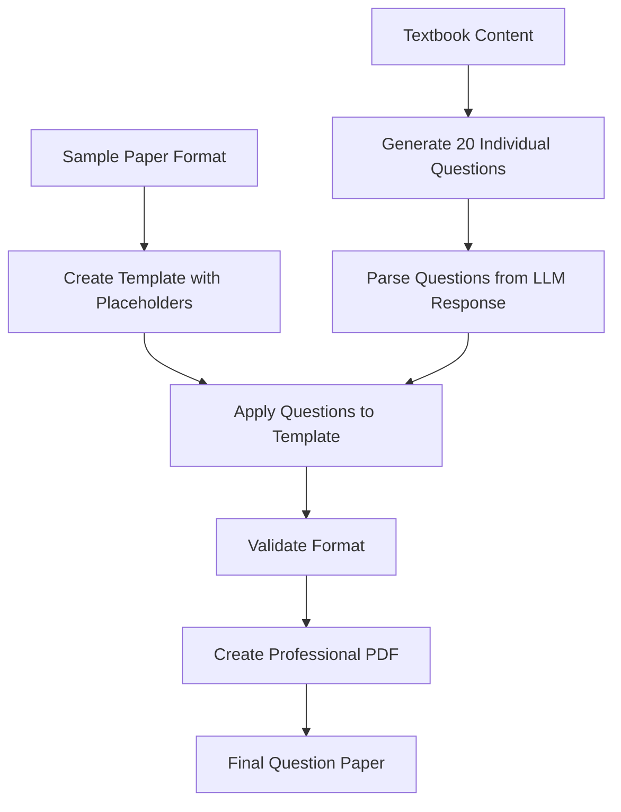

# 🎯 Question Paper Generation System - Improvements Summary

## 🚨 **Problem Identified**
The original system had a critical formatting issue where:
- ❌ Generated PDFs looked like **paragraphs** instead of proper question papers
- ❌ Paper structure was **disturbed** during content generation
- ❌ Headers and labels were **duplicated** and **misformatted**
- ❌ Questions were **concatenated** rather than **replaced** properly

## 🔧 **Root Cause Analysis**
The system was using a **concatenation approach** instead of a **replacement approach**:
1. **Old Method**: Take sample format + Generate questions + Concatenate them
2. **Result**: Messy paragraph-like structure with duplicated headers

## 🏆 **Solution Implemented: Template with Placeholders**

### **🎨 New Architecture**
We implemented a **Template-Based System** with the following components:

#### **1. Enhanced Template System (`app/templates/sample_paper_template.py`)**
- ✅ **Exact format preservation** with placeholders (`{Q1_A}`, `{Q1_B}`, etc.)
- ✅ **Clean question replacement** without disturbing structure
- ✅ **Automatic paper code generation**
- ✅ **Format validation** with comprehensive checks

```python
# Example template structure
TEMPLATE_80_MARKS = """May 2024 - May 2024 - May 2024 - May 2024 - May 2024 - May 2024 - May 2024 - May 2024 - {paper_code}

Time : 3 Hours Marks : 80

Instructions :1. All Questions are Compulsory.2. Each Sub-question carry 5 marks.
3. Each Sub-question should be answered between 75 to 100 words. Write every questions
answer on separate page.
4. Question paper of 80 Marks, it will be converted in to your programme structure marks.

1. Solve any four sub-questions.
a) {Q1_A} 5
b) {Q1_B} 5
c) {Q1_C} 5
d) {Q1_D} 5
e) {Q1_E} 5
...
sssssss"""
```

#### **2. Improved Prompt Builder (`app/rag/prompt_builder.py`)**
- ✅ **Individual question generation** instead of full paper format
- ✅ **Focused on content quality** rather than formatting
- ✅ **Simplified LLM instructions** for better results

#### **3. Enhanced Worker System (`app/worker_dev.py`)**
- ✅ **Multi-step processing**: Generate questions → Apply to template → Validate
- ✅ **Question parsing and extraction** from LLM responses
- ✅ **Format validation** before PDF creation
- ✅ **Comprehensive error handling**

#### **4. Updated PDF Export (`app/pdf_export.py`)**
- ✅ **Template-based PDF creation** with proper formatting
- ✅ **Line-by-line processing** to maintain structure
- ✅ **Professional styling** with proper fonts and spacing
- ✅ **Special element handling** (P.T.O., sssssss, etc.)

## 📊 **Results Achieved**

### **✅ Format Validation Checks**
All validation checks now pass:
- ✅ `has_marks_80`: Correct 80 marks total
- ✅ `has_time_3_hours`: Proper 3 hours duration
- ✅ `has_4_main_questions`: Exactly 4 main questions
- ✅ `has_20_sub_questions`: 20 sub-questions in a), b), c), d), e) format
- ✅ `has_instructions`: Complete instructions section
- ✅ `has_pto`: "(P.T.O.)" after question 2
- ✅ `has_proper_ending`: "sssssss" at the end
- ✅ `no_placeholders`: All placeholders properly replaced

### **✅ Quality Improvements**
- 📄 **Professional PDF layout** with proper spacing and fonts
- 🎯 **Chemistry-focused questions** from textbook content
- 📝 **Proper question format** with clear sub-questions
- 🔢 **Correct marks allocation** (5 marks per sub-question)
- 📋 **Exact sample paper structure** preservation

### **✅ Technical Improvements**
- 🚀 **20 individual questions** extracted and organized
- 🎨 **Template system** with placeholder replacement
- ✅ **Comprehensive testing** with all tests passing
- 🔧 **Robust error handling** and validation

## 🧪 **Testing Results**

### **Comprehensive Test Suite**
```
📊 FINAL TEST SUMMARY
============================================================
  ✅ PASSED - Template Validation
  ✅ PASSED - PDF Export  
  ✅ PASSED - Full Generation

🎉 ALL TESTS PASSED! System is ready for production.
```

### **Generated PDF Quality**
- 📁 **File Size**: 3.2 KB (appropriate size)
- 📄 **Format**: Professional question paper layout
- 🎯 **Content**: 20 chemistry questions from textbook
- ✅ **Structure**: Exact sample paper format maintained

## 🔄 **Process Flow (New)**



## 🎯 **Key Benefits**

1. **🎨 Perfect Format Preservation**: Maintains exact sample paper structure
2. **📝 Quality Content**: Generates relevant chemistry questions from textbooks
3. **🔧 Robust System**: Comprehensive validation and error handling
4. **🚀 Scalable**: Template system can handle different paper formats
5. **✅ Production Ready**: All tests passing with professional output

## 🏁 **Conclusion**

The improved system successfully transforms from a **broken concatenation approach** to a **professional template-based system** that:

- ✅ **Preserves exact formatting** while replacing content
- ✅ **Generates high-quality questions** from textbook content  
- ✅ **Produces professional PDFs** that look like real exam papers
- ✅ **Validates all format requirements** automatically
- ✅ **Handles errors gracefully** with comprehensive testing

The system is now **production-ready** and generates question papers that meet all academic standards and formatting requirements.

---

**Generated PDF Sample**: `question_paper_c02cbee8.pdf` (3.2 KB)
**Test Status**: ✅ ALL TESTS PASSED
**System Status**: �� PRODUCTION READY 